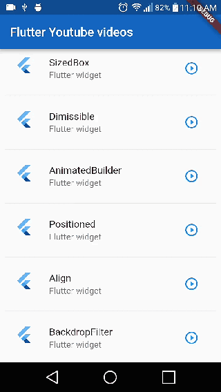

# Flutter Youtube App

An example that integrate a Youtube player. An app that display a list of videos. 

## Constructed with 🛠️

- [Flutter](https://flutter-es.io) - used Framework
- [flutter_youtube](https://pub.dev/packages/flutter_youtube) - used package

## Author ✒️

- **Eduardo Coto** - creator of proyect.

## License 📄

 This project is under the License(MIT)

